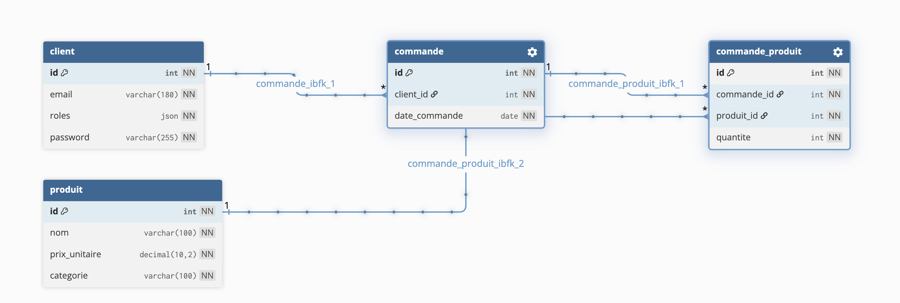
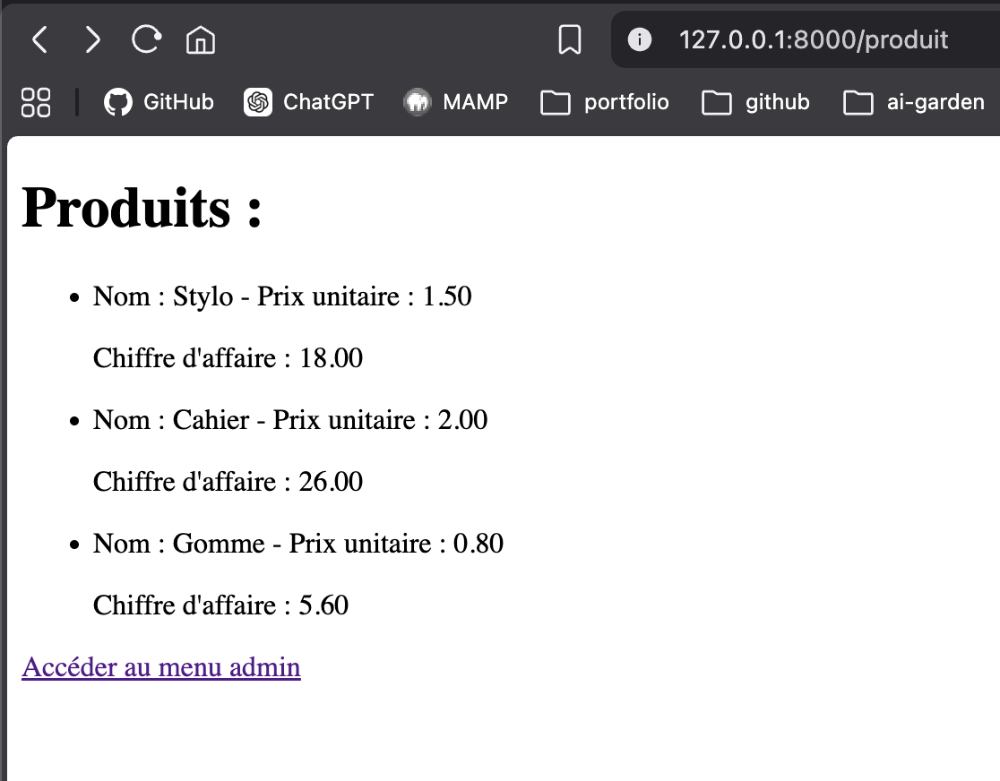
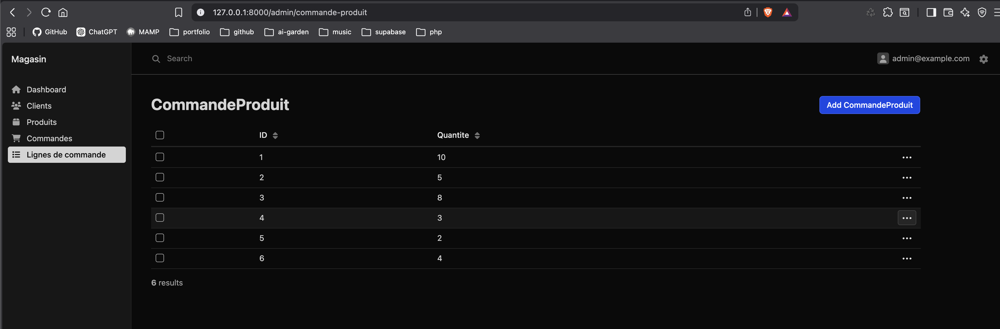

# Exercice 1 Chiffre d'affaire par produit
- Auth login/logout/register
- Dashboard et CRUD admin
- Roles Admin/User
- Fonction personnalisée (chiffreAffaireParProduit), comprendre les relations

# Exercice 2 Top 3 des produits les plus vendus
Affiche les 3 produits ayant été achetés en plus grande quantité (somme des quantités).
- Comprendre les jointures, alias, fonctions d'agregations (WHERE,COUNT,SUM...), relations (OneToMany...) via diagramme de bdd relationnelle
# Exercice 3 Chiffre d’affaires par client
Pour chaque client, calcule le total des achats (quantité × prix unitaire) sur toutes ses commandes.
- Comprendre comment traduire les requêtes SQL et lire les requêtes doctrine
# Exercice 4 Commandes du mois en cours
Liste toutes les commandes passées depuis le début du mois en cours, avec le détail des produits achetés.
- Comprendre comment écrire les requêtes doctrine
# Exercice 5 Produits jamais vendus
Affiche les produits qui n’ont jamais été achetés dans aucune commande.
- Comprendre LEFT JOIN
# Exercice 6 Chiffre d’affaires par catégorie
Pour chaque catégorie de produit, calcule le chiffre d’affaires total généré (quantité × prix unitaire).
- Ecrire la fonction uniquement à l'aide du diagramme